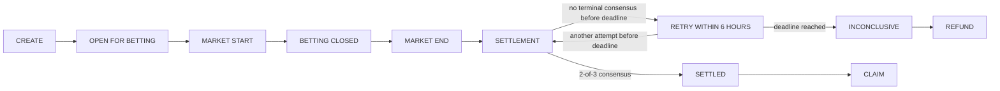
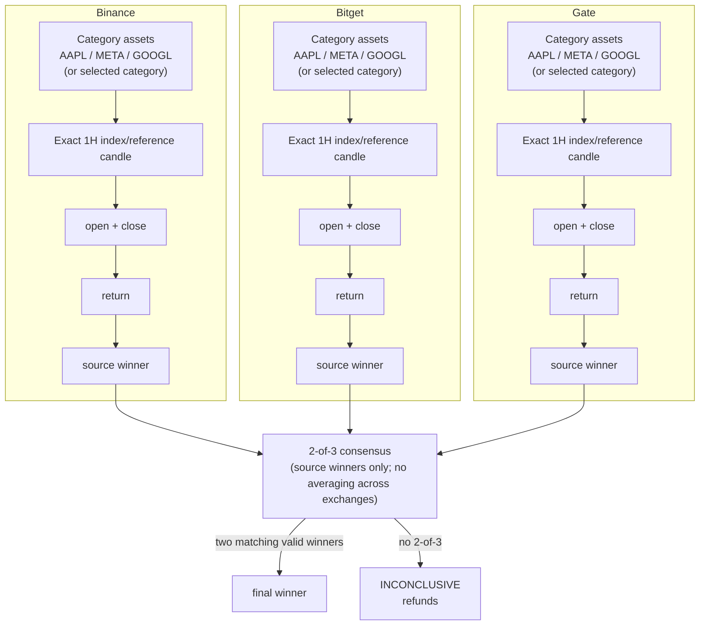
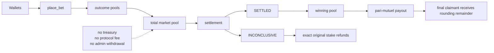

# Dominion

Permissionless one-hour stock dominance markets, settled by 2-of-3 independent exchange consensus on GenLayer.

Dominion is a GenLayer Intelligent Contract for focused, short-horizon markets on the relative performance of three stocks in a fixed category. Anyone can create a future exact-hour market, choose one outcome with native GEN, and settle an expired market. The contract reads bounded index/reference candles from Binance, Bitget, and Gate, then stores the evidence and outcome on-chain.

## Live Links

- Frontend: [frontend source](./frontend); no public deployment URL is recorded in this repository.
- GitHub: `<GitHub repository URL>` placeholder; the repository URL is not available in this workspace.
- Bradbury contract: `0xec08425932105bC12c2B9A7F91D50Be60DDAEBa4` — no explorer URL is assumed.
- Network: GenLayer Bradbury Testnet, chain ID `4221`; [Bradbury RPC endpoint](https://rpc-bradbury.genlayer.com).

## The Problem

Stock markets produce enormous amounts of noisy short-term information. People often compare companies informally—who led Big Tech during the last hour, or which AI stock moved first—but there is no simple permissionless market for the precise question: which stock led this category during this exact hour?

Traditional betting and prediction products can depend on platform-defined markets, centralized resolution, or outcome rules that are difficult to inspect. Other systems average price feeds, mix data types, or rely on a single oracle or operator. A short-horizon comparative market needs a precise UTC window, a deterministic return calculation, independently checked evidence, and a transparent terminal path when evidence cannot converge.

## Why This Market Should Exist

Prediction-market research studies how financial incentives can encourage participants to act on dispersed information and express their beliefs through prices or positions. The literature reports that market-generated forecasts are often strong relative to moderately sophisticated benchmarks and can incorporate new information quickly, while also emphasizing that accuracy depends on market and contract design. See [Wolfers and Zitzewitz][research-prediction-markets] and [Snowberg, Wolfers, and Zitzewitz][research-economic-forecasting].

Dominion applies that general idea to a deliberately narrow question. Participants are not forecasting an absolute price or even simply asking whether a stock will rise; they are choosing which of three fixed assets will have the highest numerical percentage return in one defined hour. The comparison set and end time reduce ambiguity, making the market a focused coordination and information instrument, while permissionless creation lets markets form around the future hours users actually care about. These are Dominion design choices, not a claim that the cited research studied Dominion or that every prediction market is accurate.

## Vision

Dominion was created around a small question that is easy to understand and hard to settle well: which stock had the highest return during this exact hour?

The goal is to make short-horizon market competition accessible without requiring an administrator to create each market or resolve each result. A creator selects a fixed category and a future UTC hour; any participant can choose an outcome; and any wallet can attempt settlement after expiry. The rules, source evidence, pool accounting, and terminal state are defined by the contract rather than by a private operator.

The broader pattern is reusable: a deterministic comparison over externally observed data, paired with evidence-based resolution and a bounded path to refunds. Dominion combines that protocol structure with a consumer-grade frontend so the market remains understandable without hiding how it settles.

## The Solution

Dominion provides:

- Three fixed categories, each containing three fixed stocks.
- Exact one-hour UTC windows derived from a numeric Unix `market_start`.
- Permissionless market creation for a valid future category/hour pair.
- Native GEN pari-mutuel betting with one wallet-selected outcome per market.
- No Dominion protocol fee.
- Binance, Bitget, and Gate index/reference candles for settlement evidence.
- Independent per-source winner selection followed by 2-of-3 final consensus.
- Permissionless settlement after the market window ends.
- Pull-based winnings claims and original-stake refunds.

## How It Works

1. **Create Market** — A wallet selects a fixed category and a future UTC hour aligned to `3,600` seconds.
2. **Place Bet** — Before the start time, a wallet sends at least `1 GEN` and selects one of the category’s three stocks.
3. **Market Opens** — The market remains open for betting until its numeric start timestamp.
4. **One-Hour Window Runs** — The contract’s fixed window runs from `market_start` to `market_start + 3,600` seconds.
5. **Anyone Settles** — After expiry, any wallet may call `settle_market`.
6. **Sources Vote** — Each approved source independently validates the exact candle and nominates a winner.
7. **Winner / Inconclusive** — Agreement produces `SETTLED`; otherwise the market can become `INCONCLUSIVE` through the settlement rules or deadline fallback.
8. **Claim Winnings or Refund** — Winning positions claim their pari-mutuel payout; inconclusive positions reclaim their exact accumulated stake.

### Market Lifecycle



### Settlement Consensus



### Funds Flow



## Architecture

Dominion is organized around one contract-owned state machine:

| Layer | Responsibility |
| --- | --- |
| `contracts/Dominion.py` | Category and time validation, betting custody, bounded web reads, candle validation, fixed-point returns, source ranking, validator equivalence, consensus, accounting, claims, refunds, and terminal states. |
| Settlement inputs | Binance, Bitget, and Gate index/reference candle endpoints are selected by the contract. Their responses are treated as untrusted external text and validated against the requested asset, interval, and timestamp. |
| `frontend/` | TanStack application using `genlayer-js` for live contract reads and injected-wallet writes. It presents contract state and transaction progress; it does not supply prices or payout decisions. |

After expiry, settlement obtains one result per approved source and stores canonical evidence for the market. A market either records a winner with `SETTLED` state or records a refundable `INCONCLUSIVE` state. The exact state-ownership boundary is documented in [Contract as the Source of Truth](#contract-as-the-source-of-truth).

## Key Innovations

### Permissionless market creation

Anyone can create a valid future market for one of the locked categories and one future exact UTC hour. The contract derives the three assets and rejects invalid, unaligned, duplicate, or non-future starts.

### Permissionless settlement

The creator is not required to settle a market. Any wallet can call `settle_market` after expiry, subject to the contract’s evidence and timing rules.

### Per-source winner first

Dominion does not average exchange prices or returns. Each source independently computes the three asset returns and chooses a winner before source results are compared.

### 2-of-3 source consensus

Two matching valid source winners are sufficient to settle. A source that is tied or unavailable contributes no vote.

### Reference/index price settlement

Settlement uses index/reference candles: Binance `indexPriceKlines`, Bitget `type=INDEX`, and Gate `index_<ASSET>_USDT`. This is distinct from relying on an ordinary last-traded futures candle.

### Negative-return correctness

The contract compares numerical returns, not whether they are positive. If all three assets fall, the least-negative return wins: `-0.2%` beats `-0.5%`.

### Tie-safe settlement

Equal return units at the contract’s deterministic precision produce `TIE` for that source and do not cast a source vote.

### Deterministic fixed-point arithmetic

External decimal prices are normalized to integers. Return comparisons and pool calculations use integer arithmetic with no floating-point settlement path.

### Settlement liveness fallback

Settlement can retry from market end through a six-hour window. After the stored deadline, any caller can finalize the still-open market as `INCONCLUSIVE` without another web call, making positions refundable.

### Crown-style dust handling

Ordinary winning claims use integer floor division. The final winning claimant receives the remaining integer pool, so complete claims do not leave rounding dust trapped in the market.

### Contract-backed frontend

The deployed contract is the runtime source of truth for protocol state. The frontend uses local state only for presentation and temporary read caching; it has no mock runtime markets or local protocol database.

## Technical Pillars

### Deterministic Time

`market_start` is a numeric Unix timestamp in `u256` seconds. It must be strictly greater than the deterministic GenLayer transaction timestamp and divisible by `3,600`, which aligns it to an exact UTC hour. The contract derives a fixed `3,600`-second end time, closes betting at the start, and derives the settlement deadline as the end plus six hours. No wall-clock API is used for protocol timing.

### Fixed-Point Pricing

Price text is normalized to an `18`-decimal integer scale. Returns are stored as signed integer units of `10^-6` percentage points, using deterministic half-away-from-zero rounding. No floating-point operation is used for settlement arithmetic or winner selection.

### Bounded External Data

Each source must return one completed candle for each of the three category assets at the exact requested timestamp and interval. Responses are bounded to `65,536` bytes. Strict parser checks reject malformed shapes, wrong source or symbol metadata, wrong category/asset, wrong interval, missing or duplicate candles, stale or future timestamps, non-positive or non-numeric prices, HTTP errors, and unexpected source identifiers.

### Validator Equivalence

Source evidence is fetched and recomputed independently by the leader and validator. Under the current strict equivalence model, validator evidence must match the leader evidence for the source, category, timing, status, winner, and deterministic candle rows. This is safety-first: a different witness can cause a retry even when it implies the same winner; the deadline fallback protects financial liveness.

### Pool Accounting

Pools are isolated by market and outcome. Aggregate additions are checked as `u256`, payout multiplication/division avoids constructing an unchecked wide product, refunds are exact, and transfer recipients are derived from the immediate caller. No arbitrary recipient is accepted by a claim or refund method.

### Read Model

The frontend-facing read model is paginated and contract-backed:

- `get_markets`
- `get_open_markets`
- `get_user_position`
- `get_user_positions`
- `get_claimable_markets`
- `get_source_evidence`
- `get_user_activity` and `get_user_activity_count`

Pages are bounded by the contract’s maximum page size of `50`. Market views include state-derived timing, pools, settlement availability, winner, and remaining liability; position views include the selected asset, stake, claim/refund status, and claimable amount.

## Market Categories

Category membership is fixed by the contract. A creator chooses a category and future exact hour, not arbitrary stocks.

| Category | Fixed assets |
| --- | --- |
| **BIG TECH** | `AAPL`, `META`, `GOOGL` |
| **AI & GROWTH** | `NVDA`, `PLTR`, `TSLA` |
| **CRYPTO & FINTECH** | `MSTR`, `COIN`, `HOOD` |

## Settlement Rules

For each source and each asset, the contract evaluates the exact completed candle for the market hour and computes:

```text
((close - open) / open) * 100
```

The implementation normalizes the decimal inputs, then compares the resulting integer return units at `10^-6` percentage-point precision.

- The highest numerical return wins.
- `+1.0%` beats `+0.5%`.
- `-0.2%` beats `-0.5%`.
- Exact ties at protocol precision produce no source vote.
- Sources are not averaged; each source nominates its own winner first.

The final state is determined from the three source votes:

| Source result | Final state | Winner |
| --- | --- | --- |
| 3 same valid winners | `SETTLED` | Agreeing asset |
| 2 same valid winners | `SETTLED` | Agreeing asset |
| 1 valid vote only | `INCONCLUSIVE` | None |
| 2 disagreeing valid votes + useless third | `INCONCLUSIVE` | None |
| 3 different valid winners | `INCONCLUSIVE` | None |
| No usable 2-of-3 agreement | `INCONCLUSIVE` | None |

Here, “useless” means tied or unavailable. A valid source consensus with no bets still settles normally; it simply has no claimants.

## Betting and Payouts

- Bets use native GEN only.
- The minimum bet is `1 GEN` (`10^18` base units).
- Dominion imposes no maximum bet; normal `u256`, balance, and runtime constraints still apply.
- Each wallet selects one outcome per market.
- Same-outcome top-ups are allowed and accumulate.
- Switching to a different outcome is rejected.
- Betting closes exactly at market start.
- The protocol fee is `0%`.
- There is no AMM, order book, leverage, or early cash-out.

For a normally settled market, the proportional payout is:

```text
user payout = user winning stake × total market pool / total winning outcome stake
```

The contract performs this as integer floor division. The final winning claimant receives the remaining market pool after earlier claims, including any integer rounding remainder. That remainder is distribution accounting, not a fee.

## Refund Logic

`INCONCLUSIVE` markets are refundable:

- Each bettor can reclaim the exact original accumulated stake for that market.
- A consensus winner with zero backing does not redirect funds to a backed losing outcome. If the market has a nonzero pool and the actual winner has zero stake, the financial state becomes `INCONCLUSIVE`; the actual winner remains recorded for audit and bettors receive refunds.
- A valid consensus with zero total bets can still become `SETTLED` normally because there is no financial liability to refund.
- A source-consensus failure records an empty winner and makes positions refundable.

Refunds are pull-based and caller-bound. Each wallet calls `claim_refund` for its own stored position, and the contract prevents repeat refunds or cross-market accounting use.

## Trust and Safety

Dominion deliberately has no privileged financial path:

- No admin withdrawal, creator withdrawal, treasury sweep, or emergency recovery method.
- No winner override or arbitrary payout recipient.
- The creator has no financial privilege after creation.
- The settlement caller cannot choose prices, source results, or the winner.
- Claims and refunds derive from the caller’s stored position and send value to that caller.

The main operational boundaries are external and explicit. Exchange endpoints can be unavailable or return data that fails validation. Validators can disagree or observe different source witnesses under strict equivalence. Settlement is retryable for six hours after expiry, then requires a caller to trigger the deterministic `INCONCLUSIVE` fallback.

Native GEN delivery uses the current finalized EVM value-transfer interface and effects are recorded before the external transfer is emitted. The current documented runtime boundary is that a recipient-level rejection may not provide a synchronous parent-visible result that lets the contract reopen a consumed claim. EOA delivery and payable contract-wallet delivery are expected integration paths, but recipient acceptance remains a runtime concern and is not described as a protocol guarantee.

## Contract as the Source of Truth

Canonical Dominion protocol state comes from the deployed Dominion contract. The frontend must not own canonical copies of:

- market state
- pools
- positions
- winners
- claims
- refunds
- activity
- settlement evidence

The frontend may cache contract reads temporarily for rendering, but after a confirmed write it refetches the contract state. Allowed local state is presentation-only: filters, form input, chart display data, company names, and UI metadata. There is no `localStorage` or `sessionStorage` protocol persistence and no mock runtime market state.

## Frontend

The frontend is a TanStack application backed by `genlayer-js`. It reads markets, positions, pools, settlement evidence, claims, refunds, and wallet activity from the deployed contract, and sends writes through an injected browser wallet on Bradbury Testnet.

The application includes market discovery and detail views, Portfolio, permissionless market creation, and a How It Works page. Transaction feedback covers wallet signature, submission, GenLayer processing, and finalized success. Portfolio positions and claim/refund actions are derived from contract reads.

The live performance chart is informational only. It displays live index-price performance for the selected market window and cannot influence settlement or alter contract state. The notification bell is sourced from the contract’s on-chain activity records; read/unread presentation is not an on-chain protocol field.

## Developer Reference

The deployed contract exposes 19 public methods: 14 views and 5 writes.

### Read Methods

```text
categories() -> string[]
category_assets(category: string) -> string[]
get_config() -> dict
get_market(market_id: u256) -> dict
get_markets(offset: u256, limit: u256) -> dict[]
get_open_markets(offset: u256, limit: u256) -> dict[]
get_user_position(market_id: u256, user: address) -> dict
get_user_positions(user: address, offset: u256, limit: u256) -> dict[]
get_claimable_markets(user: address, offset: u256, limit: u256) -> dict[]
get_market_by_category_start(category: string, market_start: u256) -> dict
get_user_activity_count(user: address) -> u256
get_user_activity(user: address, offset: u256, limit: u256) -> dict[]
get_source_evidence(market_id: u256, source: string) -> dict
get_betting_state(market_id: u256) -> dict
```

### Write Methods

```text
create_market(category: string, market_start: u256) -> u256
place_bet(market_id: u256, asset: string) payable -> void
settle_market(market_id: u256) -> string
claim(market_id: u256) -> void
claim_refund(market_id: u256) -> void
```

## Repository Structure

```text
.
├── contracts/
│   └── Dominion.py
├── docs/
│   ├── architecture.md
│   └── audit.md
├── frontend/
│   ├── src/
│   │   ├── components/
│   │   ├── lib/dominion/
│   │   └── routes/
│   ├── package.json
│   ├── README.md
│   └── ...
├── tests/
│   ├── direct/
│   │   ├── conftest.py
│   │   ├── test_audit_and_read_model.py
│   │   ├── test_betting.py
│   │   └── test_dominion.py
│   ├── integration/
│   │   └── test_dominion_integration.py
│   └── conftest.py
├── gltest.config.yaml
├── requirements.txt
└── README.md
```

## Testing and Validation

The current repository verification baseline is:

- `136` direct tests passed.
- `3` integration tests skipped because deployment is opt-in.
- GenVM lint passed: `3` checks.
- Deployed Bradbury schema extraction passed: `19` methods (`14` views, `5` writes).
- Frontend TypeScript check passed with `npx tsc --noEmit`.
- `contracts/Dominion.py` is `41,111` bytes, below the `52,224`-byte limit by `11,113` bytes.

Local validation commands:

```bash
genvm-lint check contracts/Dominion.py
.venv/bin/pytest tests/direct/ -q
.venv/bin/pytest tests/integration/ -q
cd frontend && npx tsc --noEmit
```

The integration collection is gated by `DOMINION_RUN_INTEGRATION=1` and related start-time variables. The default local commands do not deploy the contract.

## Live Validation

The project’s Bradbury validation history includes live market creation, real GEN bets, and a live settlement test. That testing surfaced a source-window boundary: Bitget and Gate treated the upper query bound inclusively in observed responses. Those endpoint queries now use `end - 1`, and an exact-start regression fixture verifies that the intended candle is selected.

## Known Limitations

- Exchange API availability can delay or prevent evidence collection.
- Nondeterministic-source results require leader and validator convergence under the current strict evidence model.
- Someone must call `settle_market`; settlement is not an automatic background process.
- The six-hour fallback also requires a caller.
- The live performance chart is informational and is not settlement truth.
- Recipient-level native GEN transfer acceptance remains a runtime concern, especially for a contract wallet that rejects the transfer.

## Why GenLayer

Dominion needs to read real-world web evidence while keeping the resulting market state deterministic. GenLayer supplies validator-backed nondeterministic reads, agreement over independently observed exchange data, deterministic contract storage and accounting, and a permissionless path for anyone to submit resolution.

## Deployment

- **Network:** GenLayer Bradbury Testnet (`chain ID 4221`)
- **Contract:** `0xec08425932105bC12c2B9A7F91D50Be60DDAEBa4`
- **Frontend:** No public frontend URL is documented in this repository. Use the [frontend source](./frontend) for local development.

## Research Notes / References

The rationale above uses general prediction-market literature, not evidence that academic studies evaluated Dominion specifically.

- [Justin Wolfers and Eric Zitzewitz, “Prediction Markets,” American Economic Association / Journal of Economic Perspectives 18(2), 2004](https://www.aeaweb.org/articles?id=10.1257%2F0895330041371321). DOI: `10.1257/0895330041371321`.
- [Erik Snowberg, Justin Wolfers, and Eric Zitzewitz, “Prediction Markets for Economic Forecasting,” NBER Working Paper 18222, 2012](https://www.nber.org/papers/w18222). DOI: `10.3386/w18222`.

## License

No license file is present in this repository.

[research-prediction-markets]: https://www.aeaweb.org/articles?id=10.1257%2F0895330041371321
[research-economic-forecasting]: https://www.nber.org/papers/w18222
