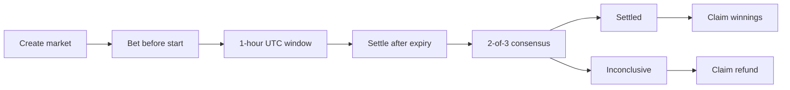
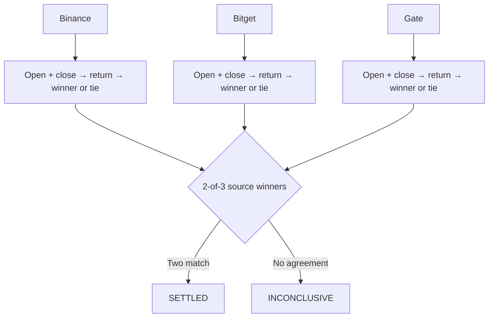
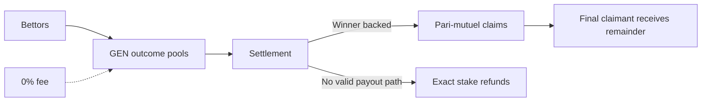

# Dominion

Dominion is a permissionless 1-hour stock dominance prediction market on
GenLayer. Users choose which stock will lead a fixed category during an exact
UTC hour, stake native GEN, and claim a pari-mutuel payout when independent
exchange evidence reaches 2-of-3 consensus.

## What is Dominion?

Dominion turns a simple comparative question into an on-chain market:

> Which stock leads this category during this exact hour?

Anyone can create a valid future market, bet on one of its three fixed stocks,
or trigger settlement after the window ends. The contract uses deterministic
rules for timing, returns, consensus, pools, claims, and refunds.

## Why Dominion?

Traders constantly compare which company is outperforming its peers, but that
comparison usually lives in charts, opinions, and social discussion. Dominion
defines the question precisely: three stocks, one UTC hour, one transparent
return calculation, and no centralized resolver.

The result is a focused market with permissionless creation, visible evidence,
and a clear path to either winnings or refunds.

## How It Works

1. Choose a fixed category and future exact UTC hour.
2. Bet at least `1 GEN` on one of the category’s three stocks.
3. The market runs for exactly one hour; betting closes at the start.
4. Binance, Bitget, and Gate independently evaluate the completed reference
   candle for each stock.
5. Two matching source winners settle the market.
6. Winners claim the pari-mutuel pool. Inconclusive markets refund original
   stakes.



## Key Innovations

- **Permissionless creation:** Any wallet can create a valid future category/hour
  market; the contract derives the assets.
- **Permissionless settlement:** Any wallet can call `settle_market` after the
  market expires.
- **Per-source winner selection:** Each source computes its own three-stock
  ranking before source results are compared. Prices and returns are never
  averaged across exchanges.
- **Evidence-based consensus:** Two matching valid source winners are enough to
  settle; a tied or unavailable source casts no vote.
- **Deterministic returns:** Prices are normalized to fixed-point integers and
  compared without floating-point settlement arithmetic.
- **Bounded fallback:** An expired market remains callable through a six-hour
  settlement deadline. If it cannot produce a valid consensus, it becomes
  `INCONCLUSIVE` and positions become refundable.
- **Pari-mutuel GEN pools:** The protocol charges `0%`, with no AMM, order book,
  leverage, or house edge.

## Market Categories

| Category | Fixed stocks |
|---|---|
| **BIG TECH** | `AAPL` · `META` · `GOOGL` |
| **AI & GROWTH** | `NVDA` · `PLTR` · `TSLA` |
| **CRYPTO & FINTECH** | `MSTR` · `COIN` · `HOOD` |

Category membership is fixed by the contract. Users cannot replace the assets.

## Settlement

For every source and asset, Dominion reads the completed 1-hour index/reference
candle for the market start hour and calculates:

```text
return = ((close - open) / open) * 100
```

The contract compares return units at deterministic fixed-point precision:

- The highest numerical return wins.
- If every return is negative, the least-negative return wins.
- An exact highest-return tie produces no source vote.
- Each source selects its winner independently.
- No raw prices or returns are averaged across exchanges.

Sources use the locked index/reference candle paths for Binance, Bitget, and
Gate. Validator equivalence checks the bounded source evidence and deterministic
fields before it can count as a source result.



| Source votes | Result |
|---|---|
| 3 matching valid winners | `SETTLED` with that winner |
| 2 matching valid winners | `SETTLED` with that winner |
| One valid vote, two non-votes | `INCONCLUSIVE` |
| Two different votes with no matching third | `INCONCLUSIVE` |
| Three different valid winners | `INCONCLUSIVE` |
| Tied or unavailable source | No vote |

## Betting and Payouts

- Bets use native GEN. `1 GEN = 10^18` base units.
- There is no Dominion-imposed maximum bet; protocol numeric, balance, and
  runtime constraints still apply.
- A wallet selects one stock per market. Same-stock top-ups accumulate; side
  switching is rejected.
- Betting is open only before the exact market start.
- The protocol fee is `0%`.

For a normally settled market:

```text
payout = winning stake * total market pool // winning outcome pool
```

Integer floor division is used for ordinary claims. The final winning claimant
receives the remaining pool, including any rounding remainder, so all pool GEN
is distributable after the winners claim.

If the winning stock has zero stake while the market has bettors, the actual
price winner is retained for audit but the market becomes `INCONCLUSIVE`; every
position can reclaim its original accumulated stake. A valid consensus with no
bets still settles normally because there are no liabilities.



## Built on GenLayer

Dominion uses GenLayer to resolve bounded external web evidence while keeping
the resulting market state deterministic. Validators independently retrieve and
validate the approved source data; the contract stores the resulting evidence,
winner, pools, claims, and refunds. The deployed Dominion contract is the sole
protocol source of truth.

## Contract

- **Network:** GenLayer Bradbury Testnet
- **Chain ID:** `4221`
- **Address:** `0xec08425932105bC12c2B9A7F91D50Be60DDAEBa4`

The contract exposes 14 views and 5 writes.

Important reads include `get_config`, `get_markets`, `get_open_markets`,
`get_market`, `get_betting_state`, `get_user_position`,
`get_user_positions`, `get_claimable_markets`, `get_source_evidence`, and
`get_user_activity`.

Writes are `create_market`, payable `place_bet`, `settle_market`, `claim`, and
`claim_refund`.

## Frontend

The frontend is a TanStack application using `genlayer-js` and an injected
browser wallet on Bradbury. It presents live contract-backed markets,
positions, claims, refunds, and activity, with transaction lifecycle feedback.

The live performance chart is informational only: it shows relative return
data for the market window and cannot determine settlement or alter contract
state.

## Testing

- `136` direct tests passed.
- `3` integration tests remain opt-in skipped because deployment is disabled by
  default.
- GenVM lint passed.
- Schema extraction passed: `19` methods (`14` views, `5` writes).
- Contract typecheck passed.
- Contract size: `41,111` bytes, below the `52,224`-byte limit.

## Repository Structure

```text
contracts/
frontend/
tests/
docs/
README.md
gltest.config.yaml
requirements.txt
```

## Run Locally

Contract validation:

```bash
genvm-lint check contracts/Dominion.py
.venv/bin/pytest tests/direct/ -q
```

Frontend development:

```bash
cd frontend
bun install
bun run dev
```

The frontend normally runs at `http://localhost:5173`.
